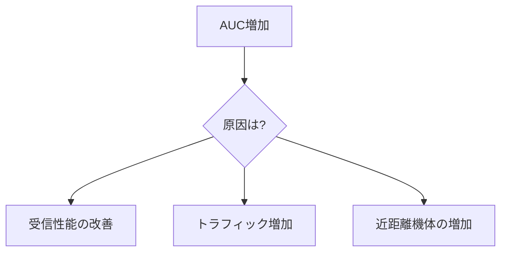

## はじめに

ADS-B受信環境を改善するとき、多くの人は tar1090 の画面や graphs1090 のグラフを見て、「昨日より機体数が多い」「先週より遠距離が受信できている」といった形で結果を確認します。グラフを目視して「良くなった」と判断する。これが一般的な評価方法です。

私が **ARENA** を作り始めた動機はシンプルでした。アンテナ変更・フィルタ追加・SDR交換・ソフトウェア設定といったパラメータが、**受信性能にどの程度寄与しているのか**を知りたかったのです。

例えばアンテナを交換したとき、それが本当に受信性能の改善なのか、それとも単にその日の航空機トラフィックが多かっただけなのか。目視では判断できません。問題の根本は、**ADS-B受信には標準的な評価指標が存在しない**ことです。

> **実験した → でも評価できない**

この問題を解くには、まず**受信性能を定量化する指標**が必要でした。

---

## 目視評価の限界

tar1090 や graphs1090 を見れば、前日比や先週比といった比較は目視で可能です。aircraft seen が増えている、グラフの高さが上がっている、こうした変化は確認できます。

しかしここから分かるのは**傾向**だけです。次の3つは分かりません。

- **改善の大きさ** ― どれくらい良くなったのか
- **偶然かどうか** ― 統計的に有意なのか
- **パラメータの寄与度** ― 何が効いたのか

「改善しているように見える」と「実際に改善している」は別の問題です。

さらに、graphs1090 のグラフは本質的に**時間 × 機体数**の関係を示しています。人間は無意識に**グラフの面積**を見て評価していますが、面積を目視で比較できるのはせいぜい数日が限界で、長期間の比較はほぼ不可能です。

---

## 面積を数値にするという発想

1日の aircraft seen グラフを見ると、私たちはピークの高さよりも**どれだけ長く機体が見えていたか**を無意識に評価しています。見ているのは高さではなく面積です。

ならば、この面積を数値として計算できれば、**時間全体の受信量を定量化できる**のではないか。

つまり必要だったのは、グラフを「眺める」のではなく、**面積を比較可能な数値に変換する方法**でした。

この構造を考えていたとき、薬学で学んだ概念を思い出しました。

---

## Cmax ではなく AUC ― 薬物動態からの着想

薬物動態には2つの基本指標があります。

| 指標 | 意味 |
|------|------|
| **Cmax** | 血中濃度の最大値（ピーク） |
| **AUC** | 血中濃度 × 時間の積分値（総曝露量） |

Cmax は「瞬間的にどれだけ高いか」、AUC は「全体としてどれだけ効いているか」を表します。

ADS-B受信に置き換えると、この対応関係が成り立ちます。

| 薬物動態 | ADS-B受信 |
|----------|-----------|
| Cmax（最大血中濃度） | 最大受信距離・瞬間最大機体数 |
| AUC（曝露量） | 時間全体の受信総量 |

ADS-Bコミュニティでは最大受信距離（＝Cmax）が注目されがちですが、これは偶然の影響を強く受けます。高高度を飛ぶ1機がたまたま良い角度で入れば、それだけで最大距離は跳ね上がります。

つまり、最大距離は「ピーク性能」を表しますが、**受信環境の実力を表すとは限りません。**

受信環境の実力を評価するには、Cmax ではなく AUC を見るべきです。なぜなら受信環境の性能は「どれだけ遠くまで届いたか」よりも「**どれだけ安定して受信できるか**」に強く依存するからです。

$$
\text{AUC} = \sum N(t) \cdot \Delta t
$$

ここで $N(t)$ は時刻 $t$ における受信機体数、$\Delta t$ は時間間隔です。これにより、**時間全体でどれだけ受信できているか**を1つの数値で表せます。

グラフの面積という曖昧な視覚情報が、比較可能な数値になります。

実際に私の環境では、SDRを RTL-SDR V4 から Airspy Mini に交換した際、最大受信距離はほとんど変わりませんでしたが、AUCは大幅に増加しました。最大距離だけを見ていたら「変わっていない」と結論していたはずです。AUCがあったからこそ、受信環境の改善を数値として捉えることができました。

---

## AUCの設計方針 ― 距離重みをあえて入れない

AUCを設計する際、距離に対する重み付けは**あえて行いませんでした**。

例えば次のような重み付き指標は簡単に作れます。

$$
\text{AUC}_w = \sum N(t) \cdot w(d) \cdot \Delta t
$$

ここで $w(d)$ は距離に応じた重みです。しかしこの重みは、線形にも二乗にも対数にも任意係数にもできてしまいます。つまり、結果が「受信性能の変化」ではなく「重みの置き方」に左右されやすくなります。

そのため採用した方針は**最小仮定**です。

距離情報はAUCに組み込まず、**距離帯別分析として独立に扱います。**

| 指標 | 役割 |
|------|------|
| AUC | 受信総量の定量化 |
| 距離帯分析 | 受信構造の解析 |

この分離により、評価関数への恣意的な重み付けを排除できます。

---

## AUCの利点

**瞬間値に依存しない**

最大距離や瞬間的な機体数ピークは偶然の影響を強く受けます。AUCは時間積分なので、短期的なノイズを平均化できます。

**長期比較が可能**

AUCは1日・1週間・1ヶ月など任意の期間で算出・比較できます。目視では不可能だった長期比較が数値として可能になります。

**比較単位を固定できる**

AUCは同じ時間窓で計算すれば、日ごと・週ごと・設定変更前後で比較単位を揃えられます。「昨日と今日」「変更前1週間と変更後1週間」のように、評価の枠組みを明示的に定義できることは、目視比較にはない利点です。

---

## AUCの限界

AUCは便利ですが、それだけでは不十分です。

### 外因要因

AUCは航空機トラフィックの影響を受けます。週末・連休・天候などにより、受信設備が同じでもAUCは変化します。

例えば、快晴の連休初日は航空機が多くなりやすいです。アンテナを替えた日がたまたまその日なら、AUCの増加がハードウェア改善によるものか、単なるトラフィック増加によるものかは区別できません。

### 積分値の分離問題

AUCが増えたとき、その原因は複数考えられます。

AUCは1つのスカラー値なので、**総量は分かるが原因は分からない**指標です。

AUCで「何かが変わった」ことは分かる。しかし「なぜ変わったのか」を分解するには、別の仕組みが必要です。この原因分解を自動でやるために作ったのが ARENA です。

---

## ARENA が解こうとしていること

**ARENA**（ADS-B Reception Evaluation & Normalization Architecture）は、AUCを入口として**原因を分解する評価パイプライン**です。名前に Normalization Architecture とあるとおり、単なる集計ツールではなく、外因変動を補正して性能変化を検出するための基盤として設計しています。

主な処理は3つです。

| 処理 | 内容 |
|------|------|
| **外因補正** | OpenSky Network のトラフィックデータを使い、航空機の増減による変動を補正 |
| **距離帯分析** | どの距離帯で改善が起きたかを分解 |
| **Bayesian NB-GLM** | サンプル数が少ない実験条件でも安定した推定を実現 |

ARENAの詳細は別の記事で解説予定です。

---

## まとめ

ADS-B受信の改善を「証明」するには、目視評価から定量評価への転換が必要です。

薬物動態の AUC を応用し、**受信量 × 時間の積分値**として受信性能を定量化しました。設計方針は**最小仮定** ― 距離重みなど恣意的パラメータは排除し、距離構造は独立した分析として扱います。

ただしAUCだけでは原因を分離できないため、ARENAでは外因補正・距離帯分析・ベイズ統計推定を組み合わせて評価します。

---

## リポジトリ

ARENA と PLAO のソースコードは GitHub で公開しています。

- **ARENA**（評価・統計パイプライン）：[GitHub](https://github.com/yukimurata0421/arena-eval-engine)
- **PLAO**（エッジデータ収集）：[GitHub](https://github.com/yukimurata0421/plao-pos-collector)
- **adsb-eval**（エッジデータ収集）：[GitHub](https://github.com/yukimurata0421/adsb-eval)

---

この記事は単体で読めるように書いています。設計全体を追いたい方は、[Book版](https://zenn.dev/north_to_now/books/plao-arena-system)も参照してください。