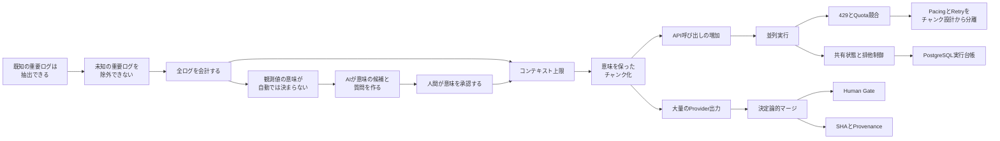
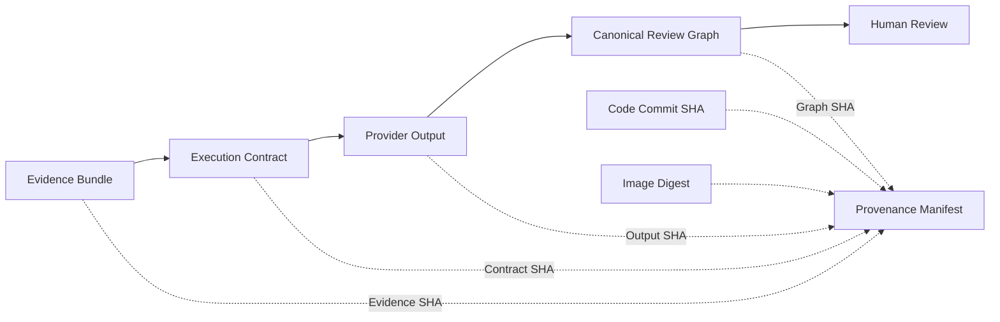

## この記事について

障害調査へAIを使うとき、モデルの性能やPromptに目が向きます。

しかし、数万行のログを扱い始めると、モデルへ渡す前の問題が先に現れます。

**解析対象から外したログに、想定外の重大事象が含まれていないと言えるのか。**

これが設計の出発点でした。

既知のエラーは抽出できます。

`ERROR`、Timeout、Connection reset、Process restart。自分が重要だと知っているパターンには、ルールを書けます。

当初の仕組みでも、ログ全体の約85%を入力上で代表できました。想定したクリティカルログも拾えていました。

それでも、残り15%の中身を説明できません。

そこに、自分がまだ知らない異常がないとは言い切れませんでした。

この問題を追っていくと、全ログの会計、意味の承認、チャンク化、並列実行、PostgreSQLによる実行台帳、決定論的マージ、SHAとProvenanceによる追跡が必要になりました。

最初から、この構成を計画していたわけではありません。

一つの制約を解くたびに、次の制約が見えました。



:::message
本稿の「100%カバレッジ」は、サニタイズ済みログの全行をEvidence Itemへ割り当てた、会計上のカバレッジを指します。

すべての障害を検出できる、すべての意味を理解できる、すべての生ログをモデルへ送る、という意味ではありません。
:::

---

## 85%で止めなかった理由

ログ解析では、既知の異常を機械的に抽出できます。

例えば、次の条件です。

- Severityが`ERROR`または`CRITICAL`
- Timeoutを示す
- Connection resetを示す
- Process restartを示す
- Watchdogの介入を示す
- 既知のError codeを含む
- 短時間に発生数が増えている

この方法なら、自分が重要だと認識しているログは拾えます。

問題は、認識していないログです。

例えば、次の記録を考えます。

```text
send_delta_bytes=0
unacked_packets=184
health=true
recovery_action=none
```

Severityは`INFO`かもしれません。`error`という文字もありません。

それでも、値の組み合わせを見ると別の読み方ができます。

送信量は増えていません。未確認パケットは残っています。Health判定は正常のままです。Recoveryも動いていません。

システムによっては、重大な停止状態です。

1回しか出ないログも同じです。低頻度だから重要でないとは限りません。障害直前の状態遷移かもしれません。

85%のカバレッジで確認できるのは、自分が想定した重要ログを収集できたことです。

確認できないのは、残り15%に想定外の重要ログが存在しないことです。

実際に取りこぼしを発見したから、設計を変えたわけではありません。

**取りこぼしていないことを説明できなかった。**

それが理由です。

---

## 全件を会計する。ただし、意味は勝手に決めない

未知の重大ログを残すには、入口で重要度を決めて捨てられません。

そこで、すべてのサニタイズ済みログを、いずれかのEvidence Itemへ割り当てます。

同じ形式のログが1万行ある場合、1万行をそのままモデルへ送る必要はありません。意味を保った単位へ集約します。

```json
{
  "evidence_id": "PATTERN-042",
  "message_template": "tcp send sample delta_bytes=<NUM> unacked=<NUM>",
  "occurrence_count": 1840,
  "first_seen": "2026-06-15T10:00:00Z",
  "last_seen": "2026-06-15T23:40:00Z",
  "severity": "INFO"
}
```

ここで重視するのは圧縮率ではありません。

各ログ行が、どのEvidence Itemへ入ったか。それを追えることです。

```text
入力したサニタイズ済みログ数
=
Evidence Itemへ割り当てたログ数
+
未割り当てログ数
```

未割り当てが0件なら、入口で消えたログはありません。

一方で、集約の仕方が粗ければ、別の形で情報を失います。

高頻度のPatternだけを残すと、Rare EventやSingletonが消えます。そのため、頻度以外の性質も残します。

| 分類 | 扱う内容 |
|---|---|
| Pattern | 繰り返し発生する事象 |
| Rare Event | 低頻度でも意味を持つ事象 |
| Singleton | 1回だけの例外や状態遷移 |
| Temporal Bucket | Spike、Gap、Burst |
| State Transition | Restart、Recovery、状態変化 |
| Tail Summary | 直接引用されない残余データ |

分類できないログも、一つの「その他」へまとめません。サニタイズ済みTemplateのFingerprintを残し、異なる未知ログを区別します。

狙いは、未知の障害を自動で見つけることではありません。

**未知だったという理由だけで、静かに消さないことです。**

### 値が残っても、意味は決まらない

全ログを残しても、正しく読めるとは限りません。

観測値と、その意味は別です。

| 観測値 | `0`が示す可能性 |
|---|---|
| `restart_count` | 再起動なし |
| `heartbeat_count` | 対象停止、または観測停止 |
| `queue_depth` | 処理待ちなし、入力途絶、Collector失敗 |
| `audio_energy` | 音声停止、または意図した無音 |

ログやMetricから取得できるのは値です。

その値をどう評価するかは、システムの目的と運用条件に依存します。

`healthy=true`と記録されていても、何を確認したHealth Checkなのかは分かりません。

Processが存在するだけなのか。Portが開いているのか。内部処理が進んでいるのか。ユーザー向け出力まで確認しているのか。

同じ`healthy`でも、意味は大きく変わります。

コードを読めば、Metricの生成条件は分かるかもしれません。しかし、運用上の評価には人間の意図が入ります。

定期Restartが正常な保守処理なのか。一時的な回避策なのか。本来は解消したい異常なのか。コードだけでは確定できません。

### AIには答えではなく、質問を作らせる

AIは、コード、設定、Log名、Metric名の関係から、意味の候補を作れます。

- このMetricはLivenessを示す可能性がある
- この0は処理停止を示すかもしれない
- このRestartはRecovery処理かもしれない
- このHealth CheckはProcessの生存しか見ていないかもしれない

この使い方は有効です。

人間が全コードを読み、すべての意味をゼロから整理するより速く進みます。

ただし、候補を事実にはしません。

AIは、運用者だけが知る前提を持っていないからです。

役割は、意味を確定することではありません。

**不明点を見つけ、人間が答えられる質問へ変えることです。**

例えば、次を確認します。

- このMetricが0の場合、正常か、異常か
- このHealth CheckはProcessの生存だけを見るのか
- ユーザー向け出力まで確認しているのか
- このRestartは障害復旧か、定期処理か
- 値が欠けた場合、0になるのか
- 観測失敗として区別されるのか
- このComponentが止まると、ユーザー影響が出るのか

AIは候補と質問を作ります。

人間は意味を承認し、誤っていれば修正します。

### ContextとRuntime Evidenceは分ける

人間が「このMetricは0なら異常」と承認しても、今回の障害を証明したことにはなりません。

対象時間帯で、実際に0だったか。それはRuntime Evidenceで確認します。

**意味の定義と、実際に発生した事象は別です。**

コード、設定、人間の回答はContextです。

RuntimeのログやMetricはEvidenceです。

Contextは、何を見るかを決めます。Evidenceは、何が起きたかを示します。

この区別がないと、論理が飛びます。

「コード上、その障害は起こり得る」から、「今回も起きたはずだ」とは言えません。

同じく、「運用者が重要だと言ったMetric」から、「今回の原因」とも言えません。

### コードをモデルAPIへ渡す前にサニタイズする

システムの意味を調べるには、コードや設定が役立ちます。

一方、生のSource Treeには機密情報が含まれます。

Credential、API Key、Token、内部URL、ホスト名、ローカルパス、Stream Key、環境変数の値。

そのままモデルAPIへ送る構成にはしません。

ローカル側で必要な情報を抽出します。

```text
生のコードや設定
    ↓
構造と短い抜粋を抽出
    ↓
機密情報をサニタイズ
    ↓
安全性を検査
    ↓
モデルAPIへ渡す
```

対象は、システム理解に必要な範囲です。

Componentの役割、Entry Point、Service間の接続、Metricの定義箇所、Logの出力条件、WatchdogとRecovery Loop、設定項目の構造、環境変数のKey名と型。

コード全文を送ることが目的ではありません。

必要なContextだけを渡します。

---

## 全件解析が、チャンク・並列・PostgreSQLを必要とした

全ログをEvidenceへ変換しても、一度には送れません。

モデルにはコンテキスト上限があります。

巨大なPromptには、ほかの問題もあります。

入力Tokenが増えます。実行時間も延びます。重要な信号が埋もれます。Providerごとの上限差も吸収しにくくなります。

上位N件だけを送れば簡単です。

しかし、それでは残りを再び捨てます。

そこで、コンテキスト不足をサンプリングではなく、分割で処理します。

```text
Evidence Items
    ├── Chunk 1
    ├── Chunk 2
    ├── Chunk 3
    └── Chunk N
```

件数だけでは分けません。

関連するEvidenceが離れるからです。

WAN observer timeout、TCP unacked packet increase、FFmpeg connection reset、Upload throughput drop、Watchdog recovery。

これらは、同じ障害系列かもしれません。

ランダムに分けると、各Providerは一部しか見られません。

そのため、Chunkは意味と入力上限の両方を使って作ります。

- Event family
- Event name
- Subsystem
- Component
- Coverage class
- ProviderごとのToken Budget
- ProviderごとのItem上限

ChunkはAPI都合の分割単位です。

同時に、解析の意味単位でもあります。

### 並列度は最大値ではない

Chunkが増えると、API呼び出しも増えます。

複数Providerを使う場合、実行単位は`Provider × Chunk`です。

5 Providerへ10 Chunkずつ送れば、50単位になります。

逐次実行では時間がかかります。そこで、Provider間とChunk間を並列化しました。

すると、HTTP 429が発生します。

外部APIにはQuotaがあります。

- 同時Request数
- 1分当たりのRequest数
- 1分当たりの入力Token数
- Project単位の共有Quota
- Model単位のQuota
- Region単位の容量

並列数を増やせば、常に速くなるわけではありません。

429が増えると、Retry待ちも増えます。同じQuotaを再び取り合えば、完了は遅れます。

並列度は最大化する値ではありません。

**外部制約の中でThroughputを調整する値です。**

そのため、Providerごとの最大並列数、Request開始間隔、Token量に応じたPacing、Exponential Backoff、`Retry-After`、Provider別Cooldownを分けて管理します。

### 429でSemantic Chunkを変えない

429は、入力サイズ超過を意味しません。

共有Quotaの競合かもしれません。

そのため、429を理由にSemantic Chunkを細かくしません。

Chunkを変えると、解析条件まで変わるからです。

| 処理 | 対象 |
|---|---|
| Semantic Chunking | Evidenceの意味とContext上限 |
| Pacing / Retry | Quotaと一時障害 |

429なら、同じChunkを待って再実行します。

Context Length Errorなら、入力自体がモデルへ入りません。その場合に限り、追加分割を検討します。

Evidenceを分ける理由と、Requestをやり直す理由は別です。

### 保存先から実行台帳へ

初期実装ではSQLiteを使っていました。

ローカル実行には合っています。

準備が簡単です。外部Serviceも不要です。Testも再現しやすいです。

PostgreSQLへ移した理由は、SQLiteの処理速度ではありません。

並列Workerが、同じ実行状態を共有するようになったからです。

管理対象は、Ready、Running、Success、Retry待ち、恒久失敗、Attempt回数、次回実行時刻、Provider応答、Schema検証結果、実行契約です。

複数Workerが同じChunkを取得すると、APIを二重に呼びます。

Workerが停止すれば、Runningのまま残る可能性もあります。

必要になったのは、単なる保存先ではありません。

**再開可能な実行台帳です。**

本番向けの共有台帳にはPostgreSQLを使います。

現在状態と試行履歴も分けます。

| 現在状態 | 試行履歴 |
|---|---|
| 現在のStatus | 各Attemptの結果 |
| Attempt回数 | HTTP 429 |
| 最後のError | Empty Response |
| 次回Retry時刻 | Schema Invalid |
| 最終結果 | Success |

成功しても、途中の失敗は消しません。

429やSchema Errorも、運用を見直すための記録だからです。

SQLiteを廃止したわけではありません。

ローカルFixture、Offline Demo、Smoke Testには残します。

技術を統一するより、責任を分けました。

- SQLite：単一環境のローカル処理
- PostgreSQL：並列Workerの共有台帳

---

## 本筋は、Provider実行の後にある

全Evidenceを複数Providerへ渡せるようになりました。

失敗しても再開できます。

それでも、調査は終わりません。

複数Providerと複数Chunkから、大量のClaimが返ります。

```text
Provider A: WAN connectivity timeout
Provider B: External dependency instability
Provider C: Transport path failure
Provider D: User impact is not established
Provider E: Insufficient evidence
```

そのまま表示すると、人間はAI回答を読み比べることになります。

ログを読む作業が、AI出力を読む作業へ変わっただけです。

ここで必要になるのがマージです。

### マージは要約ではない

すべての出力を別のLLMへ渡せば、短い要約は作れます。

ただし、統合結果まで非決定的になります。

どのProviderが何を主張したか。どのEvidenceを引用したか。その関係も薄れます。

そこで、マージは決定的な処理にしました。

```text
Provider Outputs
    ↓
Claimを構造化
    ↓
Evidence参照を検証
    ↓
意味単位へ正規化
    ↓
同じ論点をGroup化
    ↓
Canonical Review Graph
```

Evidence IDの完全一致では細かすぎます。

同じ現象でも、Providerが引用する行は少しずれます。

```text
Provider A: PATTERN-056, PATTERN-066
Provider B: PATTERN-067, PATTERN-068
```

完全一致を求めると、同じ現象が別Targetへ分かれます。

一方、`network`のようなSubsystemだけでは粗すぎます。

DNS Timeout、TCP Stall、Connection Reset、Route Change、外部API Timeout、Upload Pressure、Process Restartが一つに混ざります。

そこで、次の情報を使います。

- Event family
- Event name
- Subsystem
- Component
- Canonical review unit
- Canonical review family

引用の小さな差を吸収します。

同時に、異なる障害を分けます。

もちろん、完全ではありません。

同じReview Unitに複数のTarget Typeが入る場合もあります。

そのときは収束とみなしません。Divergenceとして残し、昇格も止めます。

マージで守るものは、結論の短さではありません。

**共通点をまとめても、相違点を消さないことです。**

### EmbeddingをGroupingの正本にしない

意味的なGroupingには、EmbeddingやLLMも使えます。

ただし、CanonicalなGroupingを任せると、結果が揺れます。

同じ入力でもGroupが変わる。Threshold調整が要る。Model更新で過去結果が変わる。Group化の理由も説明しにくくなります。

EmbeddingはReview Hintには使えます。

正本にはしません。

CanonicalなGroupingには、正規化した意味情報と安定したKeyを使います。

### 複数Providerを多数決にしない

複数AIの一致は、真実を証明しません。

同じEvidenceを見ています。Promptも似ています。学習データも重なる可能性があります。

同じ誤りへ収束することもあります。

そのため、Agreementの意味を限定します。

**複数Providerが、同じReview Unitを確認対象として支持した。**

原因確率ではありません。

Providerの立場も分けます。

```text
support
counter_evidence
caveat
validation_target
next_data_needed
insufficient_evidence
```

存在しないEvidence IDを引用した場合は、意見対立ではありません。

引用Errorです。Unsupportedとして別に扱います。

AgreementとDisagreementは同時に成立します。

4 Providerが異常をSupportし、1 ProviderがCounter Evidenceを提示した場合、AgreementもDisagreementもあります。

`4対1`で原因確定とはしません。

Review TargetのScoreも、原因確率ではありません。

意味はReview Priorityです。

人間が先に見る順番を決めます。

複数ProviderのSupportや引用Evidenceの量は優先度を上げます。

User Impactの未確認、Counter Evidence、必要なMetricの欠落、Target Typeの混在、Evidence参照の不正は昇格を止めます。

AIが作るのは結論ではありません。

人間が確認するReview Workです。

---

## 非決定的なAIを、どこまで追跡するか

LLMの出力は非決定的です。

同じModel名でも、結果は変わります。

生成設定が違う。Promptが変わる。Provider側のModelが更新される。

内部の推論過程を完全には追えません。

そこで、前後の境界を固定します。

```text
Evidence Bundle
    ↓
Versioned Execution Contract
    ↓
非決定的なProvider実行
    ↓
記録済みProvider出力
    ↓
決定論的Synthesis
    ↓
Canonical Review Graph
```

Evidence Bundleでは、解析したEvidence集合を固定します。

Execution Contractでは、出力へ影響する条件を固定します。

- 正確なModel Input
- Render済みPrompt
- Response Schema
- Generation設定
- Provider Adapter
- Model Identity
- API Protocol
- Safety Policy
- Tool Contract

Retry回数やWorker数は含めません。

成功したModel出力の内容を通常は変えない、運用上の設定だからです。

### MutableなModel名を固定Revisionと見なさない

`latest`や`preview`は、同じ名前のまま中身が変わります。

同じModel名だからといって、別Runで過去結果を再利用しません。

Cross-run reuseを許可するのは、ImmutableなRevisionを事前に確認できるか、監査済みのReuse Policyがある場合です。

Revisionが分からなければ、分からないまま記録します。

### SHAだけでは追跡できない

各ArtifactにSHA-256を付けても、関係は分かりません。

必要なのは系譜です。

- この出力は、どのEvidenceから生成されたか
- どのExecution Contractを使ったか
- どのコードでマージしたか
- どのGraphを公開したか

Provenance Manifestで関係を結びます。



役割は別です。

- SHA：内容を識別する
- Provenance：Artifact同士の関係を示す
- 不変Artifact：過去の内容を残す
- 決定論的Synthesis：同じ入力から同じGraphを作る

追跡できるのは、LLMの思考ではありません。

システムの境界です。

どのEvidenceを使ったか。どの実行契約だったか。Providerが何を返したか。どのコードで統合したか。どのGraphを公開したか。

ImmutableなModel Revisionを取得できない場合もあります。

そのときは、要求したModel名とProvider応答を残します。Revisionが未解決であることも記録します。

分からない部分は埋めません。

### 非決定的な生成と、決定的なマージを分ける

Provider出力の再現は困難です。

記録済み出力のマージは決定的にできます。

Stable IDでSortする。同じArtifactをDeduplicateする。同じSemantic IdentityとScoring Contractを使う。並列完了順は結果へ影響させない。

この分離により、Provider APIを再実行せず、マージだけを更新できます。

旧Synthesis結果も残せます。

すると、差分の原因を切り分けられます。

Provider出力が変わったのか。  
マージ契約が変わったのか。

この二つは別の変更です。

---

## 実データで確認した結果

45,000行のサニタイズ済みログで検証しました。

| 項目 | 結果 |
|---|---:|
| サニタイズ済みログ | 45,000行 |
| Evidence Items | 1,036件 |
| Provider | 5 |
| Provider Chunk合計 | 45 |
| 実行時間 | 8分38秒 |
| 最終失敗Chunk | 0 |
| 自動原因昇格 | 0 |

Chunk数の内訳は次の通りです。

| Provider | Chunk数 |
|---|---:|
| Gemini | 10 |
| GPT OSS | 10 |
| Mistral | 5 |
| Qwen | 10 |
| Gemma | 10 |

実行中には、一時的な失敗も記録されました。

| 失敗 | 件数 |
|---|---:|
| HTTP 429 | 4 |
| Empty Response | 3 |
| Schema Invalid | 1 |

8件ともRetryとBackoffで回復しました。

全45 Chunkが最終成功しています。

この実行で確認したのは、原因特定の正解率ではありません。

- 45,000行を全件会計できる
- 1,036 Evidence Itemsを全件解析対象へ入れられる
- Token Budget内で分割できる
- 429でSemantic Chunkを変更しない
- 途中の失敗履歴を残せる
- 未完了Chunkだけを再開できる
- 並列完了順でマージ結果が変わらない
- SupportとCounterを同時に残せる
- Agreementが原因を自動昇格しない

成功の基準は、AIが原因を断定したことではありません。

**入力、実行、失敗、出力、マージ結果を追跡できたことです。**

---

## この設計が保証しないもの

100%の意味理解は保証しません。

全ログをEvidenceへ割り当てても、分類が意味を完全に保存するとは限りません。

100%の障害検出も保証しません。

必要なMetricやTraceが収集されていなければ、後から復元できません。

Groupingも完全ではありません。

同じ問題が分裂する場合があります。異なる問題がまとまる場合もあります。そのため、元のCandidateとTarget Typeを残します。

Providerの独立性も完全ではありません。

複数Providerが、学習データや設計思想を共有している可能性があります。Provider数を、独立した証拠数とは扱いません。

Human Gateも無謬性を与えません。

人間も誤ります。Human Gateは、責任と確認機会を残す仕組みです。

PostgreSQLを使えば、運用が単純になるわけでもありません。

Migration、Connection管理、監視が増えます。だから、ローカル処理まで統一しません。

---

## まとめ

この設計は、二つの疑問から始まりました。

**残り15%に、未知の重大ログはないのか。**

**この値の意味を、AIだけで決めてよいのか。**

そこから、次の原則が生まれました。

- 全ログを会計する
- 低頻度ログを消さない
- 観測値と意味を分ける
- AIには質問を作らせる
- 人間が意味を承認する
- ContextとRuntime Evidenceを分ける
- コンテキスト不足は分割で処理する
- Semantic ChunkingとRetryを分ける
- 並列度をQuotaに合わせる
- データベースを整合性責任で選ぶ
- Provider出力を多数決にしない
- 非決定的な生成と決定的なマージを分ける
- SHAをProvenanceで結ぶ

使った技術は、どれも既存のものです。

Python、PostgreSQL、Cloud Run、SHA-256、複数のLLM API。

新しい技術を使うことが目的ではありませんでした。

**想定外のEvidenceを捨てない。**

**分からない意味を、分かったことにしない。**

**AIの出力を、そのまま結論にしない。**

この三つを守った結果、現在の構成になりました。

AIシステムの信頼性は、不確実性を消すことで生まれません。

不確実な場所を示す。  
固定できる境界を固定する。  
最後の判断を人間へ戻す。

その設計によって生まれます。

---

## リポジトリ

この記事で扱った設計は、Ops Evidence Synthesisで実装しています。

## 関連リンク

- [GitHub：実装・Architecture・ADR](https://github.com/yukimurata0421/ops-evidence-synthesis)
- [ProtoPedia：作品概要・画面・システム構成](https://protopedia.net/prototype/8892)