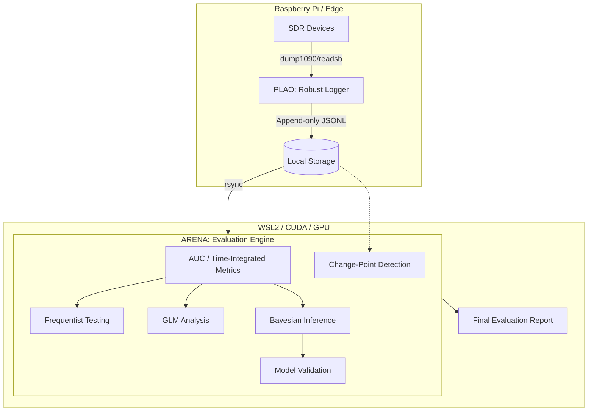

## この記事について

本記事は、ADS-B受信環境の改善を統計的に証明できる評価基盤として設計・実装した記録のシリーズ第1章です。

このシリーズでは、「アンテナを変えたら良くなった気がする」という主観から脱却し、ノイズ環境下で構成変更の効果を客観的に分離する設計を段階的に解説します。

| 章 | テーマ |
|---|---|
| **第1章（本記事）** | 問題設定と評価指標の設計 |
| 第2章 | Producer / Consumer 分離とエッジログ基盤 |
| 第3章 | 多層統計設計 ― ノイズ環境で効果を分離する |
| 第4章 | 運用品質 ― Error Accounting・CI・artifact検証 |
| 第5章 | まとめと応用可能性 |

本章ではまず、「そもそも何を測るべきか」という根本問題から整理します。

:::message
実装リポジトリ：
- [ARENA（評価エンジン）](https://github.com/yukimurata0421/arena-eval-engine)
- [PLAO（エッジロガー / Producer）](https://github.com/yukimurata0421/plao-pos-collector)
:::

## ダッシュボードの数字は何を証明しているのか

ADS-B受信環境を改善しようとすると、まずダッシュボードを確認することになります。アンテナを交換する。フィルタを追加する。ゲインを調整する。そして、「受信機体数が増えた」「最大距離が伸びた」という数値を見て、改善したと判断します。

私も最初はそうしていました。しかし数週間運用していると、疑問が生まれます。

**「この変化は本当に構成変更の効果なのか？」**

ADS-B受信は、強いノイズ環境にあります。時間帯による航空便密度の違い、平日と休日の交通量差、天候や気象条件、偶発的なトラフィック集中。ダッシュボードの値は、構成変更の効果とこれらのノイズが混ざった結果です。

ここで問題を明確にします。私がやりたいのは「数値が上がったことを確認する」ことではなく、**「構成変更によって数値が上がったことを証明する」**ことです。観測と因果は違います。因果を主張するには、まず「何を測るか」を正しく定義しなければなりません。

## 最大距離はなぜ指標として不適切か

ADS-Bコミュニティでよく使われる指標の一つに最大受信距離があります。直感的でわかりやすく、達成感もありますが、評価指標としては以下の問題があります。

1. **再現性がない**
   最大距離は単一メッセージの到達結果です。高度・送信出力・大気条件・マルチパスなどが偶然揃った結果であり、再現保証がありません。測定を繰り返しても同じ値は出ず、結論に信頼性が持てません。
2. **運用品質を反映しない**
   1日1回だけ400kmが出ても、残りの時間が100km圏内なら、安定した受信環境とは言えません。評価したいのは極端なピークではなく、日常的な受信能力です。
3. **統計的比較が困難**
   最大距離は統計学上の「外れ値」です。外れ値はノイズの影響を最も受けやすく、検定の前提が成立しにくいという性質があります。

これらの理由から、最大距離は「改善の証明」には使えないと判断しました。

## 何を最大化するのか：有効受信機体数の時間積算

では何を測るべきか。私が定義した評価対象は、**1日あたりの有効受信機体数の総量**です。

1分ごとに算出した `n_used`（有効トラック数）を積算します。TTL（Time To Live）を明示的に定義することで、`n_used` の算出は決定的かつ再現可能になります。本プロジェクトでAUC（Area Under Curve）と呼んでいる値は、以下の離散和です。

$$
\text{AUC} \approx \sum_{i} n_{\text{used}}(t_i) \times \Delta t
$$

- $n_{\text{used}}(t_i)$：時刻 $t_i$ の有効機体数
- $\Delta t$：1分（固定）

これは時間方向のリーマン和です。$\Delta t$ を固定することで、日次比較の再現性が保証されます。

## なぜ平均ではなく積算か

「1分あたりの平均有効機体数」ではなく積算を選んだのには理由があります。重要な違いは**「稼働時間」**です。

12時間稼働して平均20機の日と、24時間稼働して平均20機の日。平均は同じですが、後者の方が運用品質は高い。積算値なら、ここに自然と差が出ます。

これは意図的な設計です。評価基盤を作る以上、**「ログが安定して取れていること自体」を評価対象に含めるべき**だと考えています。欠損のある日は積算値が自然に低くなり、分析対象から除外するか、欠損を考慮した補正を行うかの判断をエンジニアに強制します。平均ではこの重要な「不都合」が隠れてしまいます。

## 指標の「圧縮」に伴う注意点

積算値（AUC）には、単発的な外れ値の影響を希釈し、持続的な改善に敏感になるという有用な性質があります。しかし、同時に**「時間軸の解像度が1つの数値に圧縮される」**という弱点も孕んでいます。

「1日中コンスタントに受信できた日」と「特定の時間帯だけ異常に多くのトラフィックがあった日」が、同じAUCとして出力される可能性があるのです。この情報の欠落を補うため、解析エンジン（ARENA）では単なる数値比較に留まらず、時間軸上での**変化点検知（Change-Point Detection）**を併用し、パフォーマンスの質的変化がいつ起きたのかを裏取りする設計にしています。

## 評価を支えるアーキテクチャ

評価を成立させるためには、まずログ基盤が安定している必要があります。そのため、システムを「収集」と「解析」で明確に分離しました。

- **PLAO（Producer）**: 責務を「こぼさず貯める」ことに限定した、ラズパイ上で動作するロガー。
- **ARENA（Consumer）**: 統計処理に特化した解析エンジン。構成変更の効果と外的要因の影響を分離するため、多角的な統計モデルを用い、そのモデル自体の妥当性検証までを行います。

## まとめ

最大距離は目立ちますが、**「再現可能で、比較可能で、持続的改善に敏感な指標」**こそが改善の証明に使える真の指標です。

本章ではその第一歩として、指標の再定義と評価対象を明確にする重要性を整理しました。次章からは、この設計を成立させるための具体的な基盤づくり、エッジデバイスでの堅牢なロギングについて解説します。

:::message
次の記事：[第2章] Producer / Consumer 分離とエッジログ基盤（近日公開）
:::